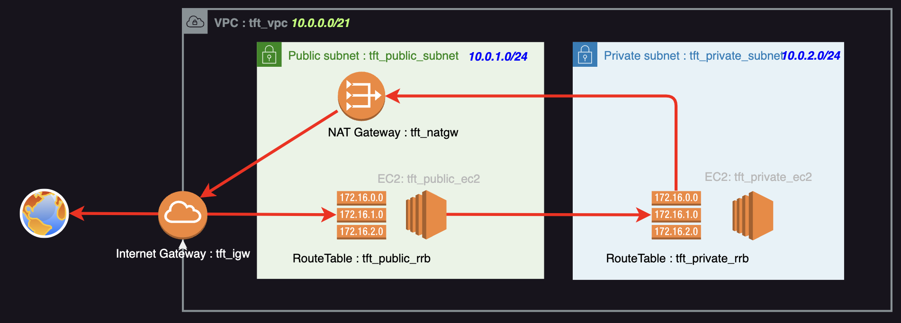

# AWS Terraform Tutorial

Tutorial for practicing Terraform. Create the following configurations:

# settings

1. Setting local Environment

    - Install AWS CLI.

      [https://docs.aws.amazon.com/ja_jp/cli/latest/userguide/getting-started-install.html](https://docs.aws.amazon.com/ja_jp/cli/latest/userguide/getting-started-install.html)

    - Set AWS Access Key to local Environment.
      > ps> aws configure

    - Install terraform 
     - refer to [official web site](https://developer.hashicorp.com/terraform/install).

## deploy Terraform Template

- git clone this repository.
  > $ git clone xxxxxx

- Type Command on shell.  
  > $ terraform init
  > $ terraform apply 
  - Enter 'cftMyIpAddress', your global IP Address.(ex:11.11.11.11/32)

## delete CloudFormation Stack

- Type Command on shell.
  > $ terraform destroy
